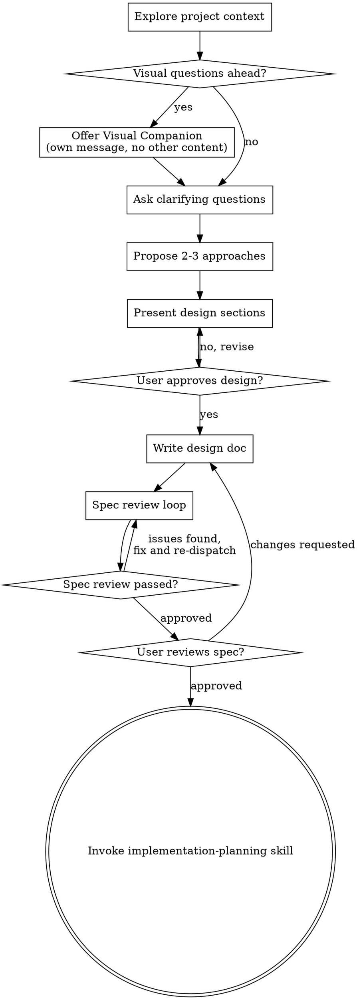

# Brainstorming Ideas Into Designs

Help turn ideas into fully formed designs and specs through natural collaborative dialogue.

Start by understanding the current project context, then ask questions one at a time to refine the idea. Once you understand what you're building, present the design and get user approval.

<HARD-GATE>
Do NOT invoke any implementation skill, write any code, scaffold any project, or take any implementation action until you have presented a design and the user has approved it. This applies to EVERY project regardless of perceived simplicity.
</HARD-GATE>

## Anti-Pattern: "This Is Too Simple To Need A Design"

Every project goes through this process. A todo list, a single-function utility, a config change — all of them. "Simple" projects are where unexamined assumptions cause the most wasted work. The design can be short (a few sentences for truly simple projects), but you MUST present it and get approval.

## Checklist

You MUST create a task for each of these items and complete them in order:

1. **Explore project context** — check files, docs, recent commits
2. **Offer visual companion** (if topic will involve visual questions) — this is its own message, not combined with a clarifying question. See the Visual Companion section below.
3. **Ask clarifying questions** — one at a time, understand purpose/constraints/success criteria
4. **Propose 2-3 approaches** — with trade-offs and your recommendation
5. **Present design** — in sections scaled to their complexity, get user approval after each section
6. **Write design doc** — save to `artifacts/current/design.md` (per Artifact Contract in CLAUDE.md)
7. **Spec review loop** — dispatch spec-document-reviewer subagent with precisely crafted review context (never your session history); fix issues and re-dispatch until approved (max 3 iterations, then surface to human)
8. **User reviews written spec** — ask user to review the spec file before proceeding
9. **Transition to implementation** — invoke implementation-planning skill to create implementation plan (per slice if a Slice Roadmap exists)

## Process Flow

**The terminal state is invoking implementation-planning.** Do NOT invoke frontend-design, mcp-builder, or any other implementation skill. The ONLY skill you invoke after brainstorming is implementation-planning.

## The Process

**Understanding the idea:**

- Check out the current project state first (files, docs, recent commits)
- Before asking detailed questions, assess scope on two axes:
  - **Subsystem count:** if the request describes multiple independent subsystems (e.g., "build a platform with chat, file storage, billing, and analytics"), flag this immediately. Don't spend questions refining details of a project that needs to be decomposed first.
  - **Size:** even a single coherent feature must be decomposed into slices when its estimated implementation diff exceeds ~1000 net lines. A feature that is conceptually one thing but ships as a 3000-line changeset is still too large to review as one batch — it needs a Slice Roadmap (see below).
- A **slice** is a group of plan tasks that completes one independently verifiable, independently mergeable end-to-end flow (1 slice = 1 Flow Verification group = 1 PR). Target net diff 300–800 lines per slice. LOC estimates are rough forcing functions for decomposition, not precise predictions.
- If the project is too large for a single spec (by subsystem count or size), help the user decompose: what are the independent pieces or slices, how do they relate, what order should they be built? Then brainstorm the first piece through the normal design flow. Each sub-project or slice gets its own spec → plan → briefing → implementation → PR cycle.
- For appropriately-scoped projects, ask questions one at a time to refine the idea
- Prefer multiple choice questions when possible, but open-ended is fine too
- Only one question per message - if a topic needs more exploration, break it into multiple questions
- For each question, provide your recommended answer and why — the recommendation reduces decision fatigue, and its trade-off reasoning is itself useful to the user
- If a *fact* can be found by exploring the codebase, look it up rather than asking. The *decisions* are the user's — put each one to them and wait
- Focus on understanding: purpose, constraints, success criteria

**Exploring approaches:**

- Propose 2-3 different approaches with trade-offs
- Present options conversationally with your recommendation and reasoning
- Lead with your recommended option and explain why

**Presenting the design:**

- Once you believe you understand what you're building, present the design
- Scale each section to its complexity: a few sentences if straightforward, up to 200-300 words if nuanced
- Ask after each section whether it looks right so far
- Cover: component responsibilities, interfaces between components, data flow, key design decisions (with rationale), constraints, and testing strategy (not test cases)
- Be ready to go back and clarify if something doesn't make sense

**Design doc scope boundary:**

The design doc answers "WHAT are we building and HOW do components interact."
It does NOT answer "HOW is each component implemented internally."

**Length guidance:** the design doc body should normally fit in ~150 lines
excluding diagrams. Exceeding it is a signal that implementation detail has
leaked in — treat it as a prompt to move content into the implementation plan,
not as a hard cap to pad up to. (The optional Learning Notes section below is
excluded from this budget.)

Include in the design doc:
- Component responsibilities and boundaries (what each piece does, not how)
- Interface signatures ONLY for contract-defining boundaries between components (the shapes consumers depend on) — not internal helper signatures
- Data flow diagrams (which components talk to which, in what order)
- Key design decisions recorded as a **decision table** (choice / alternatives rejected / why) rather than long prose
- Known constraints and trade-offs
- What is explicitly out of scope

Do NOT include in the design doc:
- Internal implementation pseudocode or processing rules
- Detailed error handling logic (just note "errors are handled gracefully")
- Complete type/class definitions (contract-boundary interface signatures are enough)
- File-by-file module structure (that belongs in the implementation plan)
- Test case specifics (just note the testing strategy at a high level)
- Step-by-step algorithms or state machine transitions

The test: if removing a section doesn't change the reader's ability to evaluate
whether the architecture decisions are correct, that section belongs in the
implementation plan, not the design doc.

**Slice Roadmap (required when the design exceeds the size budget):**

When the design's estimated implementation diff exceeds ~1000 net lines, the
design doc MUST include a `## Slice Roadmap` section. It lists ordered slices
S1..Sn, each with:
- a one-sentence scope (the one end-to-end flow the slice delivers)
- dependencies on prior slices
- acceptance criteria (how you know the slice is done)
- a rough size estimate (net lines)

Each slice then goes through its own plan → briefing → implementation → PR
cycle. A small design that fits in a single slice (≤ ~1000 lines) may omit the
roadmap.

**Learning Notes (optional):**

The design doc MAY end with a `## Learning Notes` section — educational content
for the user, who learns while building. It aggregates engineering strategies
applied, trade-offs considered (what was chosen over what and why), and key
generalizable takeaways. Write it in zh-TW prose with English technical terms.
This section is explicitly excluded from the ~150-line length budget and from
spec review scope.

**Design for isolation and clarity:**

- Break the system into smaller units that each have one clear purpose, communicate through well-defined interfaces, and can be understood and tested independently
- For each unit, you should be able to answer: what does it do, how do you use it, and what does it depend on?
- Can someone understand what a unit does without reading its internals? Can you change the internals without breaking consumers? If not, the boundaries need work.
- Smaller, well-bounded units are also easier for you to work with - you reason better about code you can hold in context at once, and your edits are more reliable when files are focused. When a file grows large, that's often a signal that it's doing too much.

**Working in existing codebases:**

- Explore the current structure before proposing changes. Follow existing patterns.
- Where existing code has problems that affect the work (e.g., a file that's grown too large, unclear boundaries, tangled responsibilities), include targeted improvements as part of the design - the way a good developer improves code they're working in.
- Don't propose unrelated refactoring. Stay focused on what serves the current goal.

## After the Design

**Documentation:**

- Write the validated design (spec) to `artifacts/current/design.md` (per Artifact Contract in CLAUDE.md)
- 主要用繁體中文撰寫，terminology 用英文。用 Mermaid 圖取代 ASCII art。
- Ensure `artifacts/` is tracked by git during planning and implementation. If `.gitignore` excludes it, temporarily remove that rule first.
- Commit the design document to git

**Spec Review Loop:**
After writing the spec document:

1. Dispatch spec-document-reviewer subagent (see spec-document-reviewer-prompt.md)
2. If Issues Found: fix, re-dispatch, repeat until Approved
3. If loop exceeds 3 iterations, surface to human for guidance

**User Review Gate:**
After the spec review loop passes, ask the user to review the written spec before proceeding:

> "Spec written and committed to `<path>`. Please review it and let me know if you want to make any changes before we start writing out the implementation plan."

Wait for the user's response. If they request changes, make them and re-run the spec review loop. Only proceed once the user approves.

**Implementation:**

- Invoke the implementation-planning skill to create a detailed implementation plan
- Do NOT invoke any other skill. implementation-planning is the next step.

## Key Principles

- **One question at a time** - Don't overwhelm with multiple questions
- **Multiple choice preferred** - Easier to answer than open-ended when possible
- **Recommend on every question** - Each question carries your suggested answer and reasoning
- **Look up facts, ask decisions** - Codebase-answerable facts are researched, never asked; decisions always go to the user
- **YAGNI ruthlessly** - Remove unnecessary features from all designs
- **Explore alternatives** - Always propose 2-3 approaches before settling
- **Incremental validation** - Present design, get approval before moving on
- **Be flexible** - Go back and clarify when something doesn't make sense

## Visual Companion

A browser-based companion for showing mockups, diagrams, and visual options during brainstorming. Available as a tool — not a mode. Accepting the companion means it's available for questions that benefit from visual treatment; it does NOT mean every question goes through the browser.

**Offering the companion:** When you anticipate that upcoming questions will involve visual content (mockups, layouts, diagrams), offer it once for consent:
> "Some of what we're working on might be easier to explain if I can show it to you in a web browser. I can put together mockups, diagrams, comparisons, and other visuals as we go. This feature is still new and can be token-intensive. Want to try it? (Requires opening a local URL)"

**This offer MUST be its own message.** Do not combine it with clarifying questions, context summaries, or any other content. The message should contain ONLY the offer above and nothing else. Wait for the user's response before continuing. If they decline, proceed with text-only brainstorming.

**Per-question decision:** Even after the user accepts, decide FOR EACH QUESTION whether to use the browser or the terminal. The test: **would the user understand this better by seeing it than reading it?**

- **Use the browser** for content that IS visual — mockups, wireframes, layout comparisons, architecture diagrams, side-by-side visual designs
- **Use the terminal** for content that is text — requirements questions, conceptual choices, tradeoff lists, A/B/C/D text options, scope decisions

A question about a UI topic is not automatically a visual question. "What does personality mean in this context?" is a conceptual question — use the terminal. "Which wizard layout works better?" is a visual question — use the browser.

If they agree to the companion, read the detailed guide before proceeding:
`design-brainstorming/visual-companion.md` (in this skill's folder)
