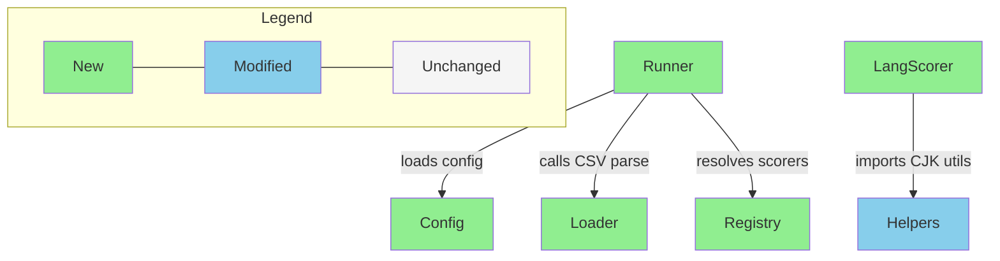

# Briefing Structure Guide

Reference this document when **creating a new briefing**. It defines each section's purpose, source, format, and content requirements.

Generate the briefing with **Section 0 (Review Focus) + 5 required sections + 2 conditional sections + a closing `## Learning Notes`**, in order. Each section pulls from specific source artifacts — the briefing is an aggregation layer, not a new analysis.

**Length target:** The briefing body (Section 0 through Section 7) should stay within **1–2 screens**. It is a review surface, not a re-derivation of the plan. `## Learning Notes` is excluded from this budget.

**Language:** Write prose in Traditional Chinese (zh-TW). Technical terminology stays in English — file paths, function names, CLI commands, code snippets, and Mermaid diagram node labels.

**Sources:**
- `impl` = `artifacts/current/implementation.md`
- `bdd` = `artifacts/current/bdd-scenarios.md`
- `vp` = `artifacts/current/verification-plan.md`
- `design` = `artifacts/current/design.md`

---

## Section 0: Review Focus

**Reviewer question**: _"我需要親自判斷哪些事?"_

**Source**: `impl` (constraints, risks, deviation notes) + `design` (decisions the planning process flagged as uncertain) + Design Delta 的「需確認」項

Placed at the very top. This is the reviewer's map: 3–5 items that genuinely need **human** judgment. Everything not listed here is implicitly routine — already gated by the agent pipeline (Three Amigos + plan reviewer + spec reviewer), so the reviewer does not need to re-check it.

Only list items that fall into one of these categories:

1. **偏離 codebase 慣例** — 本次做法與既有 convention 不同（naming、layering、error handling、既有 pattern），需要人判斷是否接受。
2. **不可逆的改動** — migration、外部 API contract、資料格式、破壞性變更；一旦 merge 難以回退。
3. **規劃過程不確定的決策** — planning 階段 explicitly 標記為 uncertain、有多個合理選項、或 Design Delta 歸類為「需確認」的項目。

Format: a short numbered list. Each item is **one line** describing what to judge + **where to look**（指向對應的 section、file path、或 scenario ID）。

```markdown
1. **`ChatService` 改用 streaming interface** — 偏離既有 sync response 慣例，影響所有 caller。→ Section 3、Task 3
2. **新增 `stream_events` migration（不可逆）** — 上線後 rollback 需要額外處理。→ Section 7
3. **SSE event format 尚未與前端定案** — planning 標記為待確認，兩種 encoding 皆可行。→ S-stream-02
```

**Rules for this section**:
- **3–5 items max.** If everything looks worth listing, the sampling is wrong — most work is routine.
- **不列 routine 項目** — 若某項已由 agent gate（Three Amigos／plan reviewer／spec reviewer）覆蓋，就不屬於這裡。
- Each item must point somewhere（section / file / scenario ID）so the reviewer can act without hunting.

---

## Section 1: Design Delta（conditional — requires design.md）

**Reviewer question**: _"Did implementation planning surface anything the design missed? Do I need to revisit the design before reviewing the rest?"_

**Source**: Sub-agent output from `agents/design-delta-reviewer.md` (compares `impl` against `design`)

This section comes first because deltas may invalidate downstream decisions. The reviewer should resolve these before proceeding to the rest of the briefing.

**Only include when** `design.md` exists. Without a design baseline, there's nothing to compare — skip and start the briefing from Section 2.

**When sub-agent returns `DELTAS_FOUND`**: paste the sub-agent output directly — each finding uses an `####` header for its title, with Design 原文 / 實際情況 / 影響 / Resolution as top-level bullets underneath. Group findings under `###` subheadings by Resolution category:

1. `### 需補充 design` (blockers — listed first if any)
2. `### 需確認` (reviewer judgment needed)
3. `### 已解決` (informational)

Omit any subheading that has no entries.

If any finding is categorized as「需補充 design」, add a prominent callout at the top of the section:

> ⚠️ 以下有 N 項發現需要回到 design 階段補充，建議先處理再繼續檢閱。

**When sub-agent returns `NO_DELTAS`**: include the section with a one-line confirmation:

> 實作規劃未發現與 design 不一致的項目，可直接檢閱後續內容。

---

## Section 2: Overview

**Reviewer question**: _"What is this change, how big is it, and what should I worry about?"_

**Source**: `impl` (Goal + task count + constraints) + `design` (`## Slice Roadmap`, when present)

One paragraph. Three things: what this change does, how many tasks, and the single biggest risk. No bullet points, no sub-headers — just a paragraph.

**When the plan covers a slice from a `## Slice Roadmap`** (`design.md` lists ordered slices S1..Sn, and this plan is one `## Slice N` group), name it explicitly in the paragraph: which slice this briefing covers（e.g.「本次為 Slice 2/4: <flow name>」）, its position in the roadmap, and its estimated size (net diff 行數 or task count). When there is no roadmap — a single-slice deliverable — say nothing about slices; the paragraph is unchanged.

Example (no roadmap):
> 本次新增 streaming chat endpoint，共拆為 4 個 task。最大風險是 SSE event format 與前端 parser 的契約需要精確對齊，parser 容錯不足可能導致 partial response 被丟棄。

Example (slice from roadmap):
> 本次為 Slice 2/4: Streaming Response（roadmap 在 Slice 1 建立 SSE 基礎後接續），共 4 個 task、預估 ~450 行 net diff。最大風險是 SSE event format 與前端 parser 的契約需要精確對齊，parser 容錯不足可能導致 partial response 被丟棄。

---

## Section 3: File Impact

**Reviewer question**: _"What files are changing, and how do they relate to each other?"_

**Source**: `impl` (File Plan)

### (a) Folder Tree

Always include. Show the file tree with annotations for new/modified/deleted files. Use IDE-style tree format.

- **New files**: annotate with `(new — short purpose)` so the reviewer understands what each file does at a glance.
- **Modified/deleted files**: annotate with `(modified)` or `(deleted)`.
- **Unchanged files**: omit entirely — only show files that are part of the change.

```
src/
├── api/
│   ├── routes.ts              (modified)
│   └── streaming.ts           (new — SSE endpoint handler)
├── services/
│   ├── chat.ts                (modified)
│   └── sse-encoder.ts         (new — event serialization)
└── types/
    └── events.ts              (new — StreamEvent type defs)
```

### (b) Dependency Flow (conditional)

**Only include when** the File Plan contains enough dependency or data-flow information to produce a meaningful diagram. If the plan only lists files and purposes without clear inter-file relationships, skip this part — do not guess at dependencies.

When included, use a Mermaid `graph` with these conventions:

- **Nodes**: Color-code by change type — green (`style ... fill:#90EE90`) for new, blue (`fill:#87CEEB`) for modified, red (`fill:#FFB6C1`) for deleted. Unchanged dependency nodes use default styling (no color).
- **Unchanged dependencies**: Include unchanged files that new/modified files depend on — the reviewer needs the full dependency chain, not just changed nodes.
- **Edge labels**: Annotate arrows with a concise reason for the dependency. One to three words — enough to answer "why does A depend on B?" without being vague. Use specifics when a single word is ambiguous (e.g., `loads config` over just `loads`; but `imports` alone is fine when context is obvious).
- **Legend**: Add a `subgraph Legend` at the bottom of the diagram so the color-coding is self-explanatory.

Example:



---

## Section 4: Task 清單

**Reviewer question**: _"What work is being done, and why?"_

**Source**: `impl` (each task's summary)

A table. One row per task. No implementation details, no TDD test cases, no architecture.

| Task | 做什麼 | 為什麼 |
|------|--------|--------|
| 1 | 建立 SSE encoder utility | 統一 streaming event 的序列化格式 |
| 2 | 新增 /api/chat/stream endpoint | 前端需要 streaming response 介面 |
| 3 | 修改 ChatService 支援 streaming output | 原本只支援 batch response |
| 4 | 定義 StreamEvent type definitions | 確保前後端 event 契約一致 |

"做什麼" is one sentence describing the deliverable. "為什麼" is one sentence explaining the motivation. Extract from each task's What & Why in the implementation plan.

---

## Section 5: Behavior Verification

**Reviewer question**: _"What behaviors are being tested, and how do we verify them?"_

**Source**: `bdd` (scenarios) + `vp` (verification methods) + `impl` (task-to-scenario mapping)

**This section is exception-based.** Scenario quality is already gated by the agent pipeline (Three Amigos + spec reviewer). The briefing does **not** re-list every scenario — it samples the highest-risk ones for the reviewer to sanity-check, and links to the full source. 5.3 (User Acceptance Test) is the exception: it stays in full because it is the reviewer's own responsibility.

Split into three subsections: **5.1 High-Risk Sample** (risk-sampled), **5.2 Post-Implementation** (risk-sampled deferred), **5.3 User Acceptance Test** (reviewer responsibility, full).

### Summary line

Start the section with a one-line summary counting total scenarios and journeys across all features, then point to the source of truth:

```markdown
> 共 N 個 illustrative scenarios（S-*）+ M 個 journey scenarios（J-*），涵蓋 K 個 features。完整清單見 `artifacts/current/bdd-scenarios.md`；以下只展開最高風險的少數 scenario 供 sanity check。
```

### 5.1 High-Risk Sample（風險抽樣）

Expand only the **3–5 highest-risk** scenarios — those with irreversible effects, external contracts, or security / money / data paths. Do **not** list the rest; they live in `bdd-scenarios.md`.

Note which Task verifies each sampled scenario inline. Each sampled scenario uses the same collapsible callout format, with a `Source verification:` line linking to the specific TC.

```markdown
> [!example]- **S-ing-04** — 重複 ingest 相同 filing 不會產生 duplicate points（UUID5 deterministic ID）｜Task 2
>
> - 為什麼抽樣：資料寫入路徑，重複寫入不可逆
> - Ingest NVDA 兩次，Qdrant point count 不變
> - Source verification: integration `TC-int-ingest-idempotent-01`
```

Each sampled scenario should carry a short **為什麼抽樣** line naming the risk category, so the reviewer knows why this one earned space.

### 5.2 Post-Implementation Deferred Verifications（風險抽樣）

Same sampling rule, scoped to scenarios that require real external services (real API calls, real corpus, real Langfuse/Braintrust) and cannot be tested with mocks during TDD. Expand only the highest-risk deferred scenarios; link the rest to `bdd-scenarios.md`.

If a scenario was partially covered during-implementation and has post-impl supplementary verification, mark it with `(post-impl 補強)` after the scenario ID.

```markdown
> [!example]- **S-ing-01** (post-impl 補強) — Class B 和 Pathological 的 real filing heading degradation
>
> - 為什麼抽樣：real corpus 才能觸發的 degradation path
> - Class B：部分 chunk 有 h3 深度，部分只到 Item level
> - Pathological：header_path = `"<ticker> / <year>"`，item = `"_unknown"`
```

### 5.3 User Acceptance Test（PR Review 時執行）

Pull out User Acceptance Test scenarios into this separate subsection. This tells the reviewer which scenarios are **their responsibility** during PR review.

```markdown
**J-eval-01 — acceptance** 🖐️<br>
Braintrust dashboard 的 scorer columns 數值合理。<br>
→ Reviewer 在 PR Review 時檢閱 Braintrust dashboard
```

### Collapsible scenario format

Each scenario uses **Obsidian callout syntax** with the `-` suffix (collapsed by default) so reviewers can scan titles without being overwhelmed by details. The callout title contains the scenario ID and a **complete behavior statement**.

**Callout types by scenario category**:
- Illustrative scenarios (S-*): `> [!example]-`
- Journey scenarios (J-*): `> [!abstract]-`

**Manual scenarios**: If the verification method is Manual Behavior Test, append 🖐️ to the callout title. This lets reviewers instantly spot which scenarios require manual effort when scanning the collapsed list.

**Important**: Leave a blank line (`>`) between the title line and the bullet list content for markdown to render correctly inside the callout.

### Scenario title: complete behavior statement

The callout title must be a **complete behavior statement** a reviewer can understand without expanding. Describe what happens and what the outcome is — not just a noun phrase.

Bad: `完整 scenario 目錄被發現並執行`（缺少結果）
Good: `包含 dataset.csv 和 eval_spec.yaml 的 scenario 目錄被自動發現，執行後產出 result CSV`

### Scenario body: concrete examples

Core behavior scenarios show the full input → setup → expected output chain. Edge case scenarios focus on the specific trigger condition and expected error/recovery behavior. Every scenario must include `Source verification:` linking to its TC.

### Rules for this section

- **Sample, never rewrite** — the briefing expands only a risk-selected subset. `bdd-scenarios.md` remains the full authority; the briefing never becomes a second copy of it.
- **Do not rewrite behaviors** — for sampled scenarios, transform the format (Given/When/Then → narrative), not the content.
- **Do not omit verification methods** — every *sampled* scenario must show how it's verified.
- **Keep scenario IDs** — they provide traceability back to the source artifacts.
- **Always link back to source** — the summary line must point to `bdd-scenarios.md` so the reviewer can reach the un-sampled scenarios.
- **5.3 is not sampled** — User Acceptance Test scenarios are the reviewer's responsibility and must be listed in full.

---

## Section 6: Test Safety Net

**Reviewer question**: _"Will this change break existing things?"_

**Source**: `impl` (test strategy sections across tasks)

Do NOT list test file names — describe coverage semantically. Split into three sub-sections based on the test's role. Omit any sub-section that has no entries.

### Guardrail（不需改的既有測試）

Narrative description. List the impact areas and briefly describe which behaviors are still protected by existing tests. No table needed — a few bullet points or a short paragraph is sufficient.

Example:
> - **Chat API routing** — request dispatch、auth guard、rate limiting 皆有 integration tests 覆蓋，不受本次改動影響。
> - **Frontend message parser** — text rendering、markdown parsing、code block highlighting 有 snapshot tests 及 interaction tests 保護。

### 需調整的既有測試

Table format. Show what's currently covered and why it needs adjustment.

| 影響區域 | 目前覆蓋 | 調整原因 |
|----------|---------|----------|
| ChatService batch mode | single request → response, error handling | Interface 從 sync 改成 stream，assertions 需對應新的 response format |

### 新增測試

High-level description of what the new tests will cover. If it's just a few areas, use bullet points instead of a table.

Example:
> - SSE encoder：event serialization format、chunk boundary handling
> - StreamEvent types：type guard validation、edge cases for malformed events

---

## Section 7: Environment / Config 變更（conditional）

**Reviewer question**: _"Are there new environment variables, dependencies, or deployment changes?"_

**Source**: `impl` (dependencies verification table, constraints, env-related task content)

**Only include this section when** there are actual environment, dependency, or config changes. If the change is purely code, this section does not appear.

When included:
- New/changed environment variables (before → after)
- New dependencies with version and purpose
- CI/CD or deployment impact

---

## Learning Notes（教育層 — 排除在 length budget 之外）

**Reviewer question**: _"這次的做法，我能學到什麼可以帶走的東西?"_

**Source**: `design`（decision rationale）+ `impl`（trade-offs、risks、constraints 背後的理由）

This is an **educational layer**, not review content. The reviewer learns while building, so this section aggregates the reasoning already recorded in the source artifacts into a form worth keeping. It sits at the **end** of the briefing and is **excluded from the 1–2 screen length budget**. It never affects scope/risk judgment — those live in Section 0–7.

Write three sub-parts, zh-TW prose with English terms:

### (a) Engineering strategies applied

本次採用的工程策略（patterns、techniques、architectural choices）與它們解決的問題。從 `design` 的決策與 `impl` 的做法中萃取——不是列出所有用到的東西，而是點出「值得記住的做法」。

### (b) Trade-offs considered

選了什麼、放棄了什麼、為什麼。每一項用「A over B，因為…」的形式，讓 reviewer 看到被否決的選項與判準。來源是 `design` 的 decision rationale 和 `impl` 的 trade-off 記錄。

### (c) Key takeaways

可以推廣到其他情境的原則（generalizable principles）。把這次的具體決策抽象成一句能帶到下一個任務的 takeaway。

**Rules for this section**:
- **Aggregate, don't invent** — every note must trace back to rationale already in `design` or `impl`. 若 source 沒有記錄理由，就不要編造。
- **Excluded from length budget** — this section does not count toward the 1–2 screen target.
- **Not review content** — edits the user makes inside Learning Notes are educational only; `apply-briefing-update` must NOT propagate them back to source artifacts.
- **Render note** — the `htmlify` skill renders this section as a floating side panel, so keep it self-contained (readable out of the briefing's linear flow).

---

## Anti-Patterns

- **Generating new analysis** — If it's not in the source artifacts, it doesn't belong in the briefing. The briefing is a lens, not a source.
- **Body exceeds ~2 screens** — The briefing body (Section 0–7, excluding Learning Notes) longer than roughly two screens means it's re-deriving the plan instead of framing it for review. Trim.
- **Review Focus lists routine items** — Section 0 must not list anything an agent gate (Three Amigos / plan reviewer / spec reviewer) already covers. If an item is routine, leave it off — its absence means "trusted", not "forgotten".
- **Wall of text** — More than 5 lines of prose without a visual break. Add a table, list, or diagram.
- **Including per-task TDD tests** — Individual test cases stay in the plan. The briefing samples BDD scenarios and shows the test safety net.
- **Forcing conditional sections** — Section 7 appears only when there's real content. Empty sections with "無" or "N/A" are noise. Section 1 (Design Delta) is the exception: when design.md exists, always include it (even a "no deltas" confirmation has value).
- **Re-listing every scenario** — Section 5 is exception-based. Copying the full scenario list from bdd-scenarios.md defeats the point; sample the highest-risk few and link to the source.
- **Rewriting BDD scenarios** — For sampled scenarios, the narrative transforms the format, not the content. Don't modify the behaviors defined in bdd-scenarios.md.
- **Mixing User Acceptance Test with other scenarios** — User Acceptance Test scenarios must be in their own subsection (5.3, in full) so the reviewer knows which ones are their responsibility during PR review.
