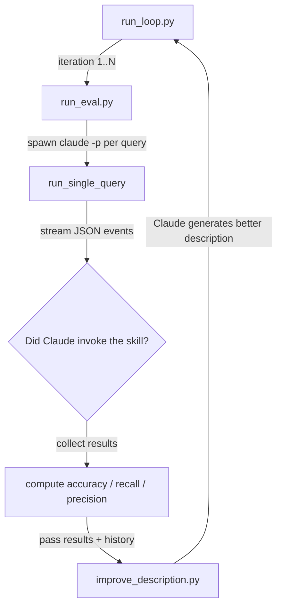
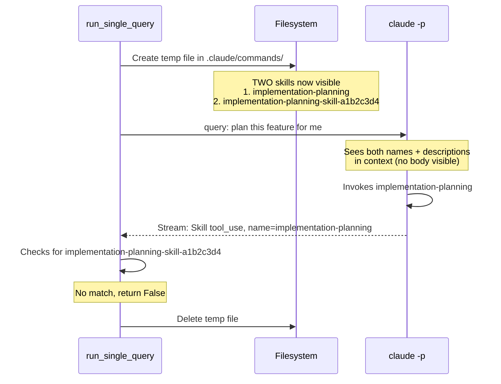
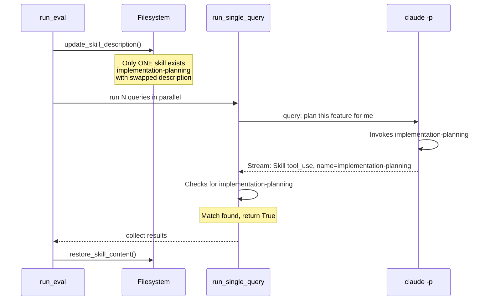

# Skill Creator Eval Pipeline — Bug Fix Walkthrough

## Background: What Does This Pipeline Do?

The Skill Creator has a **Description Improvement Loop** — an automated pipeline that optimizes a skill's `description` field (the text Claude uses to decide whether to invoke a skill) for better triggering accuracy.

The pipeline works like this:



Each iteration:

1. **Eval**: run each test query through `claude -p`, check if Claude invokes the target skill
2. **Score**: compare actual trigger/no-trigger against expected (should_trigger: true/false)
3. **Improve**: feed the results + failure analysis to Claude, ask it to write a better description
4. **Repeat**: use the new description for the next iteration

---

## The Symptom

Running the pipeline on `implementation-planning` with 20 queries (10 should-trigger, 10 should-not-trigger) produced:

```
Pre-fix (2026-03-19):
  Train accuracy: 50%    (6/12 — all 6 should-not-trigger passed, all 6 should-trigger failed)
  Test accuracy:  50%    (4/8  — same pattern)
  Recall:         0%     (0 out of 10 should-trigger queries detected)
  Precision:      N/A    (no true positives at all)
```

Every single should-trigger query showed `trigger_rate: 0.0`. The pipeline thought Claude never invoked the skill, even though Claude was actually calling it.

---

## Bug 1: Missing `client` Argument (run_loop.py) — PR 1

### The Problem

```python
# run_loop.py — BEFORE
new_description = improve_description(
    skill_name=name,
    skill_content=content,
    current_description=current_description,
    ...
)
```

`improve_description()` requires an `anthropic.Anthropic()` client as its first argument. `run_loop()` never created one and never passed it. This caused a `TypeError` the moment the loop tried to improve a description after the first eval iteration.

### The Fix

```python
# run_loop.py — AFTER
client = anthropic.Anthropic()  # created once at the top of run_loop()
...
new_description = improve_description(
    client=client,              # now passed correctly
    skill_name=name,
    ...
)
```

### Impact

Without this fix, the loop crashes after iteration 1 — you get one eval but zero improvement cycles.

---

## Bug 2: Temp Command File Identity Mismatch (run_eval.py + utils.py) — PR 2

This was the **core bug** — the reason recall was permanently 0% even though Claude was actually triggering the skill.

### The Problem — How the Old Approach Worked



The core issue: **identity mismatch**. The eval created a temp command file named `implementation-planning-skill-{uuid}` in `.claude/commands/`, while the original skill `implementation-planning` continued to exist in `.claude/skills/`.

Both `.claude/commands/` and `.claude/skills/` are [functionally equivalent](https://docs.anthropic.com/en/docs/claude-code/slash-commands) — Claude Code loads descriptions from both into context. So Claude saw two skills with similar descriptions:

```
- implementation-planning: [original description]
- implementation-planning-skill-a1b2c3d4: [test description]
```

Due to [progressive disclosure](https://docs.anthropic.com/en/docs/claude-code/slash-commands), Claude only sees **name + description** at decision time, not the full SKILL.md body. The documentation does not specify how Claude chooses between multiple matching skills, but the data shows 100% preference for the original — likely because `implementation-planning-skill-a1b2c3d4` looks like a generated/temporary artifact compared to the clean `implementation-planning` name. The detection logic checked for `implementation-planning-skill-a1b2c3d4` in the tool input, so every invocation of the original skill was counted as "not triggered."

This is why recall was exactly 0%: Claude was invoking _a_ matching skill, but the eval was looking for the wrong name.

### The Fix — In-Place Description Swap



Instead of creating a separate temp file, the fix directly modifies the real `SKILL.md`'s description field before running all queries, then restores it after. This means:

- Only one skill exists (no identity confusion)
- The name Claude invokes is the same name the eval checks for
- `try/finally` guarantees the original content is always restored

The new helpers in `utils.py`:

```python
def update_skill_description(skill_path, new_description) -> str:
    """Replace description in SKILL.md frontmatter, return original for restore."""
    # Parses YAML frontmatter, handles block scalar formats (>, |, >-, |-)
    # Writes new description as | block scalar
    # Returns original file content as a string

def restore_skill_content(skill_path, original_content) -> None:
    """Write back the original SKILL.md."""
```

### Impact

This single fix took recall from 0% to 50-75%. It was the difference between a completely broken pipeline and a working one.

---

## Bug 3: Premature `return False` in Detection Logic (run_eval.py) — PR 3

The detection logic in `run_single_query()` has two code paths for reading `claude -p` output: the **stream event path** (`type: "stream_event"`) for real-time token-level events, and the **assistant message path** (`type: "assistant"`) for partial/complete messages. Both paths had the same class of bug: **giving up too early when seeing intermediate events before the Skill tool call**.

### Bug 3a: Non-Skill Tool in Stream Event Path

```python
# BEFORE — stream event path
if se_type == "content_block_start":
    cb = se.get("content_block", {})
    if cb.get("type") == "tool_use":
        tool_name = cb.get("name", "")
        if tool_name in ("Skill", "Read"):
            pending_tool_name = tool_name
            accumulated_json = ""
        else:
            return False    # ← sees Glob/Grep/Bash → immediately gives up
```

If Claude called `Glob` or `Grep` first (common for exploration before invoking a skill), the handler immediately returned `False` without waiting to see if a `Skill` call came later.

```python
# AFTER
        else:
            pending_tool_name = None      # reset, don't track this tool
            accumulated_json = ""         # but keep listening for next tool
```

Similarly, `content_block_stop` was changed from a terminal `return` to a reset-and-continue:

```python
# BEFORE
elif se_type in ("content_block_stop", "message_stop"):
    if pending_tool_name:
        return clean_name in accumulated_json   # ← terminal

# AFTER
elif se_type == "content_block_stop":
    if pending_tool_name:
        if skill_name in accumulated_json:
            return True                          # match found
        pending_tool_name = None                 # no match, but keep listening
        accumulated_json = ""
```

### Bug 3b: Thinking-Only Message in Assistant Message Path

`claude -p --include-partial-messages` sends partial assistant messages as Claude generates output. The first message often contains only a `thinking` block:

```
assistant message #1:  { content: [{ type: "thinking", ... }] }     ← thinking only
assistant message #2:  { content: [{ type: "tool_use", name: "Skill", ... }] }  ← actual tool call
```

The old handler:

```python
# BEFORE — assistant message path
elif event.get("type") == "assistant":
    message = event.get("message", {})
    for content_item in message.get("content", []):
        if content_item.get("type") != "tool_use":
            continue
        tool_name = content_item.get("name", "")
        # ... check match ...
        return triggered    # ← returns after first content item loop
```

When it received message #1 (thinking only), the loop found zero `tool_use` items, fell through to `return triggered` (which was `False`), and **never saw message #2** which contained the actual Skill tool call.

```python
# AFTER — distinguish "has tool_use but no match" from "no tool_use at all"
elif event.get("type") == "assistant":
    message = event.get("message", {})
    has_tool_use = False
    for content_item in message.get("content", []):
        if content_item.get("type") != "tool_use":
            continue
        has_tool_use = True
        # ... check match, return True if found ...
    if has_tool_use:
        return False   # had tool_use blocks but none matched → definitive no
    # no tool_use at all (thinking/text only) → keep waiting for next message
```

The key insight: a message with **only thinking blocks** is not a final answer — Claude is still working. Only when we see actual `tool_use` blocks (that don't match) can we definitively say the skill wasn't triggered.

### Evidence: Bug 3b Confirmed on Real Data

Captured a real `claude -p` run with `--output-format stream-json --include-partial-messages` against the `implementation-planning` skill. See [bug2-evidence.md](bug2-evidence.md) for the full analysis. Key finding:

```
--- FIXED (current) ---
Result: TRIGGERED
  [78] assistant: content_types=['thinking'] -> no tool_use, keep waiting
  [88] assistant: content_types=['text'] -> no tool_use, keep waiting
  [90] stream/content_block_start: tool_use name=Skill -> TRACK
  [96] stream/content_block_delta: MATCH 'implementation-planning' in partial JSON

--- BUG 3a (non-Skill tool -> return False) ---
Result: TRIGGERED
  (not triggered in this run — Claude's first tool call was Skill, no prior Glob/Grep)

--- BUG 3b (no tool_use in message -> return False) ---
Result: NOT TRIGGERED
  [78] assistant: content_types=['thinking'] -> BUG 3b: return triggered=False
```

Bug 3b is confirmed: the thinking-only assistant message at event [78] caused the buggy code to return `False` immediately, missing the Skill call at event [90].

Bug 3a was not triggered in this particular run because Claude happened to call Skill first. However, the same log shows Claude using Glob, Read, Bash, WebSearch, and other tools in later turns — if Claude's strategy were to explore first then invoke the skill, Bug 3a would fire.

### Impact

Bug 3b causes false negatives whenever `--include-partial-messages` delivers a thinking-only message before the tool call (common behavior). Bug 3a causes false negatives when Claude explores the codebase before invoking the skill (depends on Claude's strategy per query).

---

## Results After All Fixes

```
Post-fix (2026-03-20, 3 iterations):
  Iter 1:  Train  89% (10/12)  |  Test  75% (6/8)  |  Precision 100%
  Iter 2:  Train  92% (11/12)  |  Test  88% (7/8)  |  Precision 100%  ← best
  Iter 3:  Train  94% (11/12)  |  Test  88% (7/8)  |  Precision 100%
```

The 2 remaining failures are queries with implicit intent (e.g., "read design.md and plan the implementation" — no explicit keyword trigger), which is a description quality issue rather than a pipeline bug.

---

## Deprecation Cleanup: `thinking` Config (improve_description.py)

> **Note:** This is not a bug — the original code still works. It's a deprecation cleanup.

### The Situation

```python
# improve_description.py — BEFORE
response = client.messages.create(
    model=model,
    max_tokens=16000,
    thinking={
        "type": "enabled",
        "budget_tokens": 10000,
    },
    messages=[...],
)
```

The `--model` is a required CLI argument passed through from `run_loop.py`. The SKILL.md instructs the LLM to use the model ID powering the current session (e.g., `claude-opus-4-6` on Opus, `claude-sonnet-4-6` on Sonnet).

On Opus 4.6, `type: "enabled"` + `budget_tokens` is [deprecated](https://docs.anthropic.com/en/docs/build-with-claude/extended-thinking) — it still works today but will be removed in a future release. On Sonnet 4.6 it remains fully supported. The original code isn't broken, but it relies on a deprecated API surface.

### The Change

```python
# improve_description.py — AFTER
thinking={
    "type": "adaptive",
},
```

`adaptive` lets the model decide whether to use extended thinking on its own, requires no `budget_tokens`, and works across all Claude models (Opus, Sonnet, etc.).

However, this change **weakens the original design intent**. The original `enabled` + `budget_tokens: 10000` guaranteed deep reasoning. `adaptive` without an `effort` parameter makes thinking optional — the model might skip it entirely. A more faithful replacement would be:

```python
thinking={
    "type": "adaptive",
    "effort": "high",   # encourages deep reasoning, closer to original intent
}
```

See [Building with extended thinking](https://docs.anthropic.com/en/docs/build-with-claude/extended-thinking) for the full API reference. Key differences between modes (see [extended thinking models](https://docs.anthropic.com/en/docs/about-claude/models/extended-thinking-models)):

| Mode                          | Behavior                                | Cost control                                              |
| ----------------------------- | --------------------------------------- | --------------------------------------------------------- |
| `enabled` + `budget_tokens`   | Forces thinking on, caps at N tokens    | Explicit cap via `budget_tokens`                          |
| `adaptive`                    | Model decides whether/how much to think | Self-regulated; optionally tunable via `effort` parameter |
| `adaptive` + `effort: "high"` | Strongly encourages thinking            | Semi-controlled; closer to `enabled` behavior             |

### Impact

None on current functionality — the deprecated API still works. This is a future-proofing change, not a fix.

---

## Summary

| #   | Type                | Location               | Root Cause                                       | PR  | Severity     |
| --- | ------------------- | ---------------------- | ------------------------------------------------ | --- | ------------ |
| 1   | Bug                 | run_loop.py            | Missing `client` arg → TypeError                 | 1   | Crash        |
| 2   | Bug                 | run_eval.py + utils.py | Temp file identity ≠ real skill name → recall 0% | 2   | Critical     |
| 3a  | Bug                 | run_eval.py            | Non-Skill tool → premature `return False`        | 3   | Moderate     |
| 3b  | Bug                 | run_eval.py            | Thinking-only message → premature `return False` | 3   | Moderate     |
| —   | Deprecation cleanup | improve_description.py | `thinking` config deprecated on Opus 4.6         | TBD | Non-blocking |

Bug 1 prevented the improvement loop from running (crash on first `improve_description()` call). Bug 2 made every eval result wrong (recall permanently 0%). Bug 3a/3b caused false negatives depending on Claude's response pattern. The deprecation cleanup is not a bug — the deprecated API still works today.
