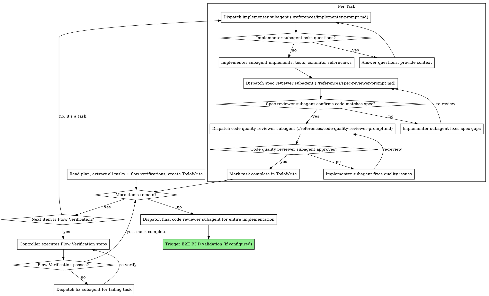

# Subagent-Driven Development

Execute plan by dispatching fresh subagent per task, with two-stage review after each: spec compliance review first, then code quality review.

**Core principle:** Fresh subagent per task + two-stage review (spec then quality) = high quality, fast iteration. Subagents never inherit your session's context — you construct exactly what they need.

## When to Use

Use when you have an implementation plan with mostly independent tasks and want to execute them in the current session with automated review gates.

**Prerequisites:**

- Implementation plan exists (from `implementation-planning` skill)
- Tasks are mostly independent (can be implemented sequentially without tight coupling)
- Subagent support available (Claude Code, Codex)

## Execution Mode Selection

At the very start of the skill, before reading the plan, ask the user which execution mode to use:

> 要用哪一種執行模式？
>
> 1. **Normal Mode** — 在目前 session 用 Agent tool dispatch implementer / reviewer subagents。每個 task 完成後 commit 一次，可以逐步 review。
> 2. **Sandbox Mode** — 把整個實作流程放在一個 Docker 容器裡 autonomous 執行。整個過程不需要 human approval，跑完才一次 commit。適合長時間無人值守的大量 task。

Default to Normal Mode if the user doesn't specify. Switch to Sandbox Mode when the user explicitly asks for "sandbox", "autonomous", "unattended", "在 container 裡跑", "無人值守", or when the plan is very large (e.g., 10+ tasks) and the user wants to walk away while it runs.

Both modes use the same implementer / spec-reviewer / code-quality-reviewer subagent prompts. The difference is *where* those subagents run and *when* commits happen.

## The Process



## Model Selection

Use the least powerful model that can handle each role:

- **Mechanical tasks** (isolated functions, clear specs, 1-2 files) → cheap model
- **Integration tasks** (multi-file coordination, pattern matching, debugging) → standard model
- **Architecture / review tasks** (design judgment, broad codebase understanding) → most capable model

Most implementation tasks are mechanical when the plan is well-specified.

## Handling Implementer Status

**DONE:** Proceed to spec compliance review.

**DONE_WITH_CONCERNS:** Read the concerns. If about correctness or scope, address before review. If observations (e.g., "this file is getting large"), note and proceed to review.

**NEEDS_CONTEXT:** Provide the missing context and re-dispatch.

**BLOCKED:** Assess the blocker:

1. Context problem → provide more context, re-dispatch same model
2. Needs more reasoning → re-dispatch with a more capable model
3. Task too large → break into smaller pieces
4. Plan itself is wrong → escalate to the human

**Never** ignore an escalation or force the same model to retry without changes. If the implementer said it's stuck, something needs to change.

## Flow Verification Checkpoints

When extracting items from the plan into TodoWrite, also extract **Flow Verification** sections as checkpoints. These appear between task groups in the plan:

```markdown
### Flow Verification: {Flow Name}

> Tasks N-M complete the {describe flow} flow.
> | # | Method | Step | Expected Result |
> ...

- [ ] All flow verifications pass
```

When the controller reaches a Flow Verification checkpoint:

1. **Do NOT dispatch an implementer subagent** — this is not a coding task
2. Execute the verification steps directly (curl, script, trace inspection, etc.)
3. If all verifications pass → mark checkpoint complete, continue
4. If any verification fails → identify which preceding task's output is wrong → dispatch a fix subagent → re-run the failed verification steps
5. Do not proceed past a failed Flow Verification checkpoint
6. If a fix requires more than 2 iterations, surface to the human

## Post-Execution

After all tasks and flow verification checkpoints are complete:

1. **Run linting** on all changed files. Fix any errors before proceeding — do not leave lint failures for the human to discover. If the project has a configured linter (e.g., `ruff check`, `eslint`), run it and fix all errors. Only proceed to step 2 after linting passes clean.
2. Dispatch a final code reviewer subagent for the entire implementation
3. If an E2E BDD validation skill is configured, trigger it now. Do not proceed until E2E validation passes or the human decides to skip it.
4. If no E2E BDD validation skill is configured, report completion to the human

## Sandbox Mode

When the user chose Sandbox Mode in the Execution Mode Selection step, replace the entire Normal Mode flow (Per-task loop + Flow Verifications + Post-Execution) with the sandbox flow below.

### Contract (Sandbox Mode)

- The whole implementation runs inside an `autonomous-claude-sandbox` Docker container
- The container dispatches its own subagents (implementer → spec review → quality review → flow verification) — same review loop, just running inside the container instead of on the host
- **No commits happen inside the container.** The container never runs any git command. All changes stay uncommitted on the host.
- The container writes `artifacts/current/temp/sdd-sandbox-report.json` before exiting. Schema: `references/sdd-sandbox-report-schema.md`.
- After the container exits, the host session reads the report, summarizes for the user, and **asks the user before making a single commit for the entire changeset.**

### Sandbox Mode Flow

1. **Verify prerequisites:**
   - `artifacts/current/implementation.md` exists
   - Docker is running (`docker info`)
   - `autonomous-claude-sandbox` skill is installed at `~/.claude/skills/autonomous-claude-sandbox/`

2. **Prepare the orchestrator prompt:**
   - Copy `references/sandbox-orchestrator-prompt.md` to `artifacts/current/temp/orchestrator-prompt.md`
   - The orchestrator prompt has no template variables — everything is static

3. **Dispatch the sandbox launcher:**

   ```bash
   bash ~/.claude/skills/autonomous-claude-sandbox/scripts/run-sandbox.sh \
     --project-dir "$PROJECT_DIR" \
     --prompt-file "$PROJECT_DIR/artifacts/current/temp/orchestrator-prompt.md" \
     --expect-output "artifacts/current/temp/sdd-sandbox-report.json" \
     --progress-pattern 'Task [0-9]+:|Flow verification:|SDD Sandbox' \
     --image-prefix "sdd-sandbox" \
     --timeout 7200
   ```

   - `--timeout 7200` is 2 hours; adjust if the plan is very large
   - Progress pattern matches the status lines the orchestrator prompt is instructed to print

4. **While the sandbox runs:** the launcher streams progress via `--progress-pattern`. You (the host controller) just watch for completion — do NOT attempt to inspect the container state, do NOT dispatch more subagents on the host, do NOT make any commits.

5. **When the sandbox exits:**
   - Read `artifacts/current/temp/sdd-sandbox-report.json`
   - If the file is missing, the sandbox failed catastrophically. Read the stream log at `artifacts/current/temp/sandbox-stream.jsonl` and surface the last 50 lines to the user.
   - If the file exists, parse `status`, `tasks`, `flow_verifications`, `final_review`, `summary`

6. **Summarize for the user:**
   - Show per-task status (completed / failed)
   - Show flow verification outcomes
   - Show final review concerns (if any)
   - Show remaining linting errors (if any)
   - List all files changed

7. **Ask the user about committing:**
   - If `status == SUCCESS`: "全部 task 都完成了，sandbox 沒有 commit。要不要現在用一個 commit 把所有改動包起來？先 review 一下 `git diff`。"
   - If `status == PARTIAL`: Surface the failed tasks and concerns first. Then ask: "Sandbox 完成了部分 task，有 N 個失敗。要 commit 已完成的部分、還是整個丟掉？"
   - If `status == ERROR`: "Sandbox 沒有跑完整個流程就中斷了。建議先 reset 工作區再看下一步。"

8. **When the user approves commit:** run `git add -A && git commit -m "<message>"` with a commit message that lists the completed tasks (derived from `tasks[*].title` where `status == completed`). One commit for the whole changeset.

### Sandbox Mode Flow Diagram

```
Host session:
  1. Ask user: sandbox or normal?
  2. [sandbox] Verify prerequisites
  3. Copy orchestrator prompt to temp
  4. Dispatch autonomous-claude-sandbox launcher
  5. Wait for launcher exit (progress streams to terminal)
  6. Read sdd-sandbox-report.json
  7. Summarize to user
  8. Ask for commit approval
  9. [user approves] One git commit, done
```

## Prompt Templates

- `./references/implementer-prompt.md` — Dispatch implementer subagent
- `./references/spec-reviewer-prompt.md` — Dispatch spec compliance reviewer subagent
- `./references/code-quality-reviewer-prompt.md` — Dispatch code quality reviewer subagent
- `./references/sandbox-orchestrator-prompt.md` — Sandbox Mode: full prompt sent to Claude inside the `autonomous-claude-sandbox` container
- `./references/sdd-sandbox-report-schema.md` — JSON schema for the sandbox completion report

## Example Workflow

```
You: I'm using Subagent-Driven Development to execute this plan.

[Read plan: artifacts/current/implementation.md]
[Extract all tasks + flow verifications with full text and context]
[Create TodoWrite with all items]

Task 1: Hook installation script

[Dispatch implementer subagent with full task text + context]
Implementer: Implemented install-hook command, 5/5 tests passing, committed.
[Spec reviewer] ✅ Spec compliant
[Code quality reviewer] ✅ Approved
[Mark Task 1 complete]

Task 2: Recovery modes (with review loops)

[Dispatch implementer subagent]
Implementer: Added verify/repair modes, 8/8 tests passing, committed.

[Spec reviewer] ❌ Issues:
  - Missing: Progress reporting (spec says "report every 100 items")
  - Extra: Added --json flag (not requested)

[Implementer fixes] Removed --json flag, added progress reporting
[Spec reviewer] ✅ Spec compliant now

[Code quality reviewer] Issues (Important): Magic number (100)
[Implementer fixes] Extracted PROGRESS_INTERVAL constant
[Code quality reviewer] ✅ Approved
[Mark Task 2 complete]

Flow Verification: Domain Event Pipeline

[Controller executes verification steps directly — no subagent]
[Run: mapper pipeline test script]
Result: SSE output matches expected format ✅
[Mark Flow Verification complete]

Task 3: ...

[After all tasks and flow verifications]
[Final code reviewer] All requirements met ✅
[Trigger E2E BDD validation if configured]

Done! Awaiting human decision on next steps.
```

## Red Flags

**Never:**

- Start implementation on main/master branch without explicit user consent
- Skip reviews (spec compliance OR code quality)
- Proceed with unfixed issues
- Dispatch multiple implementation subagents in parallel (conflicts)
- Make subagent read plan file (provide full text instead)
- Skip scene-setting context (subagent needs to understand where task fits)
- Ignore subagent questions (answer before letting them proceed)
- Accept "close enough" on spec compliance (reviewer found issues = not done)
- Skip review loops (reviewer found issues = implementer fixes = review again)
- Let implementer self-review replace actual review (both are needed)
- **Start code quality review before spec compliance is ✅** (wrong order)
- Move to next task while either review has open issues
- **Dispatch an implementer subagent for a Flow Verification checkpoint** (controller executes these directly)
- **Skip a Flow Verification checkpoint or proceed past a failed one**
- **Run git commands inside Sandbox Mode** — the sandbox container must never run `git add`, `git commit`, `git status`, or any git operation. The `/workspace` mount may be a worktree with a `.git` pointer to a host path that does not exist in the container. All commits are deferred to the host after the sandbox exits.
- **Commit before the user has reviewed the sandbox report in Sandbox Mode** — always show the summary from `sdd-sandbox-report.json` first and get explicit user approval before running `git add -A && git commit`

## Integration

**Required workflow skills:**

- **implementation-planning** — Creates the plan this skill executes
- **requesting-code-review** — Code review template for reviewer subagents

**Subagents should use:**

- **test-driven-development** — Subagents follow TDD for each task
- **frontend-test-writing** — When the task touches React components, Vitest / React Testing Library tests, Playwright E2E specs, MSW handlers, or custom hooks, the implementer subagent consults this skill during the TDD Red step (shaping what to assert) and throughout implementation. Covers query priority, state-based test decomposition, layer policy (RTL vs integration vs E2E), web-first assertions, fixtures, and the full anti-pattern catalog. The plan should already reference this skill for frontend tasks; if it does, the implementer must load it before writing test code.

**Optional post-execution:**

- **E2E BDD validation skill** (when configured) — Runs end-to-end behavioral validation after all tasks complete
