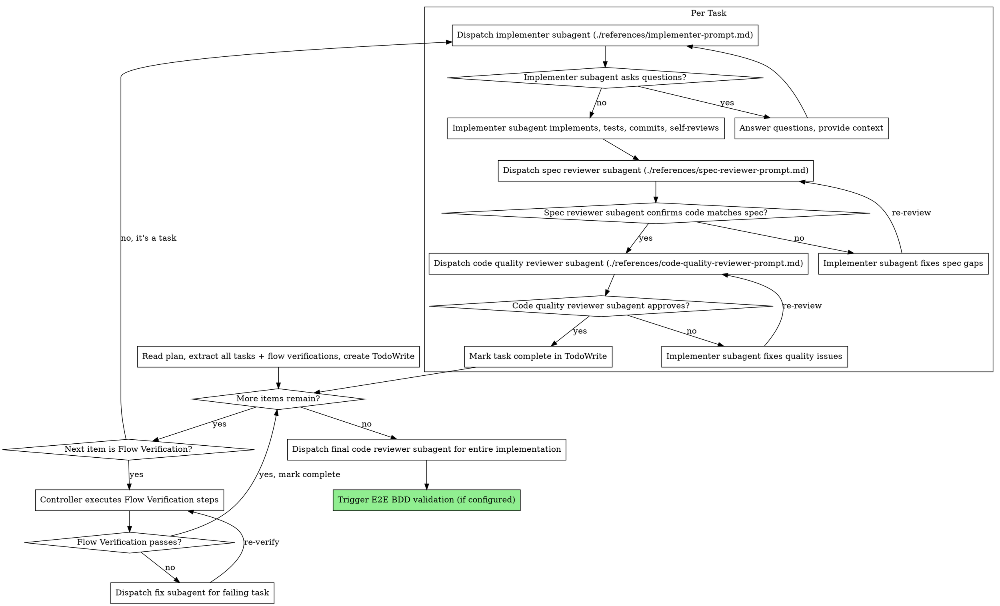

# Subagent-Driven Development

Execute plan by dispatching fresh subagent per task, with two-stage review after each: spec compliance review first, then code quality review.

**Core principle:** Fresh subagent per task + two-stage review (spec then quality) = high quality, fast iteration. Subagents never inherit your session's context — you construct exactly what they need.

## When to Use

Use when you have an implementation plan with mostly independent tasks and want to execute them in the current session with automated review gates.

**Prerequisites:**

- Implementation plan exists (from `implementation-planning` skill)
- Tasks are mostly independent (can be implemented sequentially without tight coupling)
- Subagent support available (Claude Code, Codex)

## The Process



## Model Selection

Use the least powerful model that can handle each role:

- **Mechanical tasks** (isolated functions, clear specs, 1-2 files) → cheap model
- **Integration tasks** (multi-file coordination, pattern matching, debugging) → standard model
- **Architecture / review tasks** (design judgment, broad codebase understanding) → most capable model

Most implementation tasks are mechanical when the plan is well-specified.

## Handling Implementer Status

**DONE:** Proceed to spec compliance review.

**DONE_WITH_CONCERNS:** Read the concerns. If about correctness or scope, address before review. If observations (e.g., "this file is getting large"), note and proceed to review.

**NEEDS_CONTEXT:** Provide the missing context and re-dispatch.

**BLOCKED:** Assess the blocker:

1. Context problem → provide more context, re-dispatch same model
2. Needs more reasoning → re-dispatch with a more capable model
3. Task too large → break into smaller pieces
4. Plan itself is wrong → escalate to the human

**Never** ignore an escalation or force the same model to retry without changes. If the implementer said it's stuck, something needs to change.

## Flow Verification Checkpoints

When extracting items from the plan into TodoWrite, also extract **Flow Verification** sections as checkpoints. These appear between task groups in the plan:

```markdown
### Flow Verification: {Flow Name}

> Tasks N-M complete the {describe flow} flow.
> | # | Method | Step | Expected Result |
> ...

- [ ] All flow verifications pass
```

When the controller reaches a Flow Verification checkpoint:

1. **Do NOT dispatch an implementer subagent** — this is not a coding task
2. Execute the verification steps directly (curl, script, trace inspection, etc.)
3. If all verifications pass → mark checkpoint complete, continue
4. If any verification fails → identify which preceding task's output is wrong → dispatch a fix subagent → re-run the failed verification steps
5. Do not proceed past a failed Flow Verification checkpoint
6. If a fix requires more than 2 iterations, surface to the human

## Post-Execution

After all tasks and flow verification checkpoints are complete:

1. Dispatch a final code reviewer subagent for the entire implementation
2. If an E2E BDD validation skill is configured, trigger it now. Do not proceed until E2E validation passes or the human decides to skip it.
3. If no E2E BDD validation skill is configured, report completion to the human

## Prompt Templates

- `./references/implementer-prompt.md` — Dispatch implementer subagent
- `./references/spec-reviewer-prompt.md` — Dispatch spec compliance reviewer subagent
- `./references/code-quality-reviewer-prompt.md` — Dispatch code quality reviewer subagent

## Example Workflow

```
You: I'm using Subagent-Driven Development to execute this plan.

[Read plan: .artifacts/current/implementation.md]
[Extract all tasks + flow verifications with full text and context]
[Create TodoWrite with all items]

Task 1: Hook installation script

[Dispatch implementer subagent with full task text + context]
Implementer: Implemented install-hook command, 5/5 tests passing, committed.
[Spec reviewer] ✅ Spec compliant
[Code quality reviewer] ✅ Approved
[Mark Task 1 complete]

Task 2: Recovery modes (with review loops)

[Dispatch implementer subagent]
Implementer: Added verify/repair modes, 8/8 tests passing, committed.

[Spec reviewer] ❌ Issues:
  - Missing: Progress reporting (spec says "report every 100 items")
  - Extra: Added --json flag (not requested)

[Implementer fixes] Removed --json flag, added progress reporting
[Spec reviewer] ✅ Spec compliant now

[Code quality reviewer] Issues (Important): Magic number (100)
[Implementer fixes] Extracted PROGRESS_INTERVAL constant
[Code quality reviewer] ✅ Approved
[Mark Task 2 complete]

Flow Verification: Domain Event Pipeline

[Controller executes verification steps directly — no subagent]
[Run: mapper pipeline test script]
Result: SSE output matches expected format ✅
[Mark Flow Verification complete]

Task 3: ...

[After all tasks and flow verifications]
[Final code reviewer] All requirements met ✅
[Trigger E2E BDD validation if configured]

Done! Awaiting human decision on next steps.
```

## Red Flags

**Never:**

- Start implementation on main/master branch without explicit user consent
- Skip reviews (spec compliance OR code quality)
- Proceed with unfixed issues
- Dispatch multiple implementation subagents in parallel (conflicts)
- Make subagent read plan file (provide full text instead)
- Skip scene-setting context (subagent needs to understand where task fits)
- Ignore subagent questions (answer before letting them proceed)
- Accept "close enough" on spec compliance (reviewer found issues = not done)
- Skip review loops (reviewer found issues = implementer fixes = review again)
- Let implementer self-review replace actual review (both are needed)
- **Start code quality review before spec compliance is ✅** (wrong order)
- Move to next task while either review has open issues
- **Dispatch an implementer subagent for a Flow Verification checkpoint** (controller executes these directly)
- **Skip a Flow Verification checkpoint or proceed past a failed one**

## Integration

**Required workflow skills:**

- **implementation-planning** — Creates the plan this skill executes
- **requesting-code-review** — Code review template for reviewer subagents

**Subagents should use:**

- **test-driven-development** — Subagents follow TDD for each task

**Optional post-execution:**

- **E2E BDD validation skill** (when configured) — Runs end-to-end behavioral validation after all tasks complete
