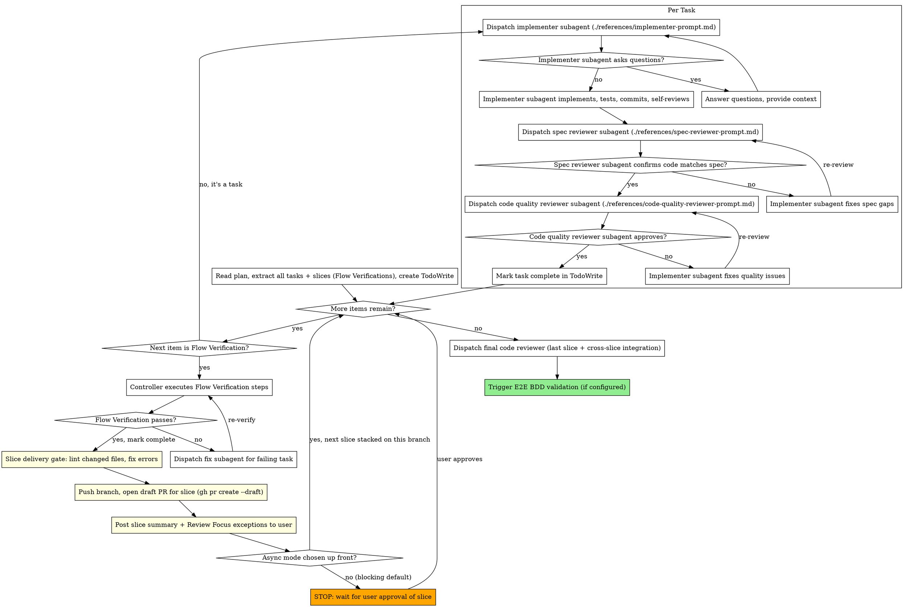

# Subagent-Driven Development

Execute plan by dispatching fresh subagent per task, with two-stage review after each: spec compliance review first, then code quality review.

**Core principle:** Fresh subagent per task + two-stage review (spec then quality) = high quality, fast iteration. Subagents never inherit your session's context — you construct exactly what they need.

## When to Use

Use when you have an implementation plan with mostly independent tasks and want to execute them in the current session with automated review gates.

**Prerequisites:**

- Implementation plan exists (from `implementation-planning` skill)
- Tasks are mostly independent (can be implemented sequentially without tight coupling)
- Subagent support available (Claude Code, Codex)

## Slice Gate Mode Selection

At the very start of the skill, before reading the plan, confirm the **slice gate mode** (a slice = one `## Slice N` group in the plan = one Flow Verification group = one PR):

> 每個 slice 完成後要怎麼交付？
>
> 1. **Blocking（預設）** — 每個 slice 通過 Flow Verification、開出 draft PR 之後就停下來等你 review，approve 才做下一個 slice。你可以逐段看到 code，不會累積成一大包。
> 2. **Async** — 不等 review，一個 slice 接著一個 slice 往下做，每個 slice 疊在前一個 branch 上（stacked）。適合你想離開讓它一路跑完的情況；缺點是後面的 slice 之後可能要 rebase review feedback。

Default to Blocking unless the user explicitly opts into async ("async", "不用等我", "一路跑完", "stacked").

## The Process



## Model Selection

Use the least powerful model that can handle each role:

- **Mechanical tasks** (isolated functions, clear specs, 1-2 files) → cheap model
- **Integration tasks** (multi-file coordination, pattern matching, debugging) → standard model
- **Architecture / review tasks** (design judgment, broad codebase understanding) → most capable model

Most implementation tasks are mechanical when the plan is well-specified.

## Handling Implementer Status

**DONE:** Proceed to spec compliance review.

**DONE_WITH_CONCERNS:** Read the concerns. If about correctness or scope, address before review. If observations (e.g., "this file is getting large"), note and proceed to review.

**NEEDS_CONTEXT:** Provide the missing context and re-dispatch.

**BLOCKED:** Assess the blocker:

1. Context problem → provide more context, re-dispatch same model
2. Needs more reasoning → re-dispatch with a more capable model
3. Task too large → break into smaller pieces
4. Plan itself is wrong → escalate to the human

**Never** ignore an escalation or force the same model to retry without changes. If the implementer said it's stuck, something needs to change.

## Flow Verification Checkpoints

Each `## Slice N: <flow name>` group in the plan is one **slice** — a set of tasks that complete one independently verifiable, independently mergeable end-to-end flow. One slice = one Flow Verification group = one PR. The Flow Verification checkpoint at the end of a slice is its delivery gate.

When extracting items from the plan into TodoWrite, also extract **Flow Verification** sections as checkpoints. These appear at the end of each slice in the plan:

```markdown
### Flow Verification: {Flow Name}

> Tasks N-M complete the {describe flow} flow.
> | # | Method | Step | Expected Result |
> ...

- [ ] All flow verifications pass
```

When the controller reaches a Flow Verification checkpoint:

1. **Do NOT dispatch an implementer subagent** — this is not a coding task
2. Execute the verification steps directly (curl, script, trace inspection, etc.)
3. If all verifications pass → mark checkpoint complete, continue
4. If any verification fails → identify which preceding task's output is wrong → dispatch a fix subagent → re-run the failed verification steps
5. Do not proceed past a failed Flow Verification checkpoint
6. If a fix requires more than 2 iterations, surface to the human

Once a slice's Flow Verification passes, do **not** immediately start the next slice — run the Slice Delivery Gate first.

## Slice Delivery Gate

A passing Flow Verification means the slice is done and mergeable. Before touching the next slice, deliver this one so the human sees code incrementally instead of one giant batch at the end. This gate is **mandatory** and runs after every slice.

1. **Lint the slice's changed files.** Run the project's configured linter (e.g., `ruff check`, `eslint`) on the files this slice touched. Fix all errors before proceeding — do not open a PR with known lint failures.
2. **Push the branch and open a draft PR for the slice.** Run `gh pr create --draft` with a title that names the slice (e.g., the `## Slice N: <flow name>` heading). Follow the `pull-request` skill for branch naming, PR description format, and any repo conventions. One slice = one PR — never fold multiple slices into a single PR.
3. **Post a concise slice summary to the user**, covering:
   - Tasks completed in this slice
   - Flow Verification results (what was checked, what passed)
   - **Review Focus exceptions** — deviations from convention, uncertain decisions, or anything the implementer/reviewers flagged that the human should look at closely
   - The draft PR link
4. **STOP and wait for the user's review (blocking — the default).** Only continue to the next slice when the user approves.
   - **Async mode** (only if the user explicitly chose it up front): do not stop. Continue the next slice on a branch **stacked on the current slice's branch**. When posting the summary, flag that later slices may need rebasing if review feedback lands on an earlier slice.

## Post-Execution

After all slices are delivered and their gates cleared, run a final pass over the whole changeset. Because each slice was already linted, PR'd, and reviewed by the human at its gate, this is **not** the human's first look at the code — it focuses on the **last slice plus cross-slice integration** (interactions and seams between slices that no single slice's Flow Verification exercised), not a from-scratch review of everything.

1. **Run linting** on all changed files. Per-slice gates already linted each slice, but re-run across the full changeset to catch anything introduced at slice boundaries. Fix any errors before proceeding. Only proceed to step 2 after linting passes clean.
2. Dispatch a final code reviewer subagent scoped to the last slice and cross-slice integration.
3. If an E2E BDD validation skill is configured, trigger it now. Do not proceed until E2E validation passes or the human decides to skip it.
4. If no E2E BDD validation skill is configured, report completion to the human

## Prompt Templates

- `./references/implementer-prompt.md` — Dispatch implementer subagent
- `./references/spec-reviewer-prompt.md` — Dispatch spec compliance reviewer subagent
- `./references/code-quality-reviewer-prompt.md` — Dispatch code quality reviewer subagent

## Example Workflow

```
You: I'm using Subagent-Driven Development to execute this plan.

[Read plan: artifacts/current/implementation.md]
[Ask: slice gate Blocking or Async? → Blocking (default)]
[Extract all tasks + slices (Flow Verifications) with full text and context]
[Create TodoWrite with all items]

=== Slice 1: Domain Event Pipeline ===

Task 1: Hook installation script

[Dispatch implementer subagent with full task text + context]
Implementer: Implemented install-hook command, 5/5 tests passing, committed.
[Spec reviewer] ✅ Spec compliant
[Code quality reviewer] ✅ Approved
[Mark Task 1 complete]

Task 2: Recovery modes (with review loops)

[Dispatch implementer subagent]
Implementer: Added verify/repair modes, 8/8 tests passing, committed.

[Spec reviewer] ❌ Issues:
  - Missing: Progress reporting (spec says "report every 100 items")
  - Extra: Added --json flag (not requested)

[Implementer fixes] Removed --json flag, added progress reporting
[Spec reviewer] ✅ Spec compliant now

[Code quality reviewer] Issues (Important): Magic number (100)
[Implementer fixes] Extracted PROGRESS_INTERVAL constant
[Code quality reviewer] ✅ Approved
[Mark Task 2 complete]

Flow Verification: Domain Event Pipeline

[Controller executes verification steps directly — no subagent]
[Run: mapper pipeline test script]
Result: SSE output matches expected format ✅
[Mark Flow Verification complete]

--- Slice 1 Delivery Gate ---
[Lint changed files] ✅ clean
[Push branch, gh pr create --draft --title "Slice 1: Domain Event Pipeline"]
  → https://github.com/org/repo/pull/42
[Post slice summary to user]
  Tasks 1-2 done, Flow Verification passed.
  Review Focus: extracted PROGRESS_INTERVAL constant (Task 2), no other deviations.
  Draft PR: #42
[STOP — blocking mode, wait for user review]

User: LGTM, continue.

=== Slice 2: ... ===

Task 3: ...

[... repeat per-task loop, Flow Verification, and Delivery Gate for Slice 2 ...]

[After all slices delivered]
[Final code reviewer — last slice + cross-slice integration] All requirements met ✅
[Trigger E2E BDD validation if configured]

Done! Awaiting human decision on next steps.
```

## Red Flags

**Never:**

- Start implementation on main/master branch without explicit user consent
- Skip reviews (spec compliance OR code quality)
- Proceed with unfixed issues
- Dispatch multiple implementation subagents in parallel (conflicts)
- Make subagent read plan file (provide full text instead)
- Skip scene-setting context (subagent needs to understand where task fits)
- Ignore subagent questions (answer before letting them proceed)
- Accept "close enough" on spec compliance (reviewer found issues = not done)
- Skip review loops (reviewer found issues = implementer fixes = review again)
- Let implementer self-review replace actual review (both are needed)
- **Start code quality review before spec compliance is ✅** (wrong order)
- Move to next task while either review has open issues
- **Dispatch an implementer subagent for a Flow Verification checkpoint** (controller executes these directly)
- **Skip a Flow Verification checkpoint or proceed past a failed one**
- **Proceed past a slice's delivery gate without explicit user approval** (unless the user chose async mode up front) — the blocking gate is the whole point of incremental delivery
- **Batch multiple slices into one PR** — one slice = one draft PR
- **Skip the Slice Delivery Gate** (lint → draft PR → summary) after a slice's Flow Verification passes

## Integration

**Required workflow skills:**

- **implementation-planning** — Creates the plan this skill executes (labels slices as `## Slice N`)
- **pull-request** — PR description format and conventions for the per-slice draft PRs opened at each delivery gate

**Subagents should use:**

- **test-driven-development** — Subagents follow TDD for each task
- **frontend-test-writing** — When the task touches React components, Vitest / React Testing Library tests, Playwright E2E specs, MSW handlers, or custom hooks, the implementer subagent consults this skill during the TDD Red step (shaping what to assert) and throughout implementation. Covers query priority, state-based test decomposition, layer policy (RTL vs integration vs E2E), web-first assertions, fixtures, and the full anti-pattern catalog. The plan should already reference this skill for frontend tasks; if it does, the implementer must load it before writing test code.

**Optional post-execution:**

- **E2E BDD validation skill** (when configured) — Runs end-to-end behavioral validation after all tasks complete
